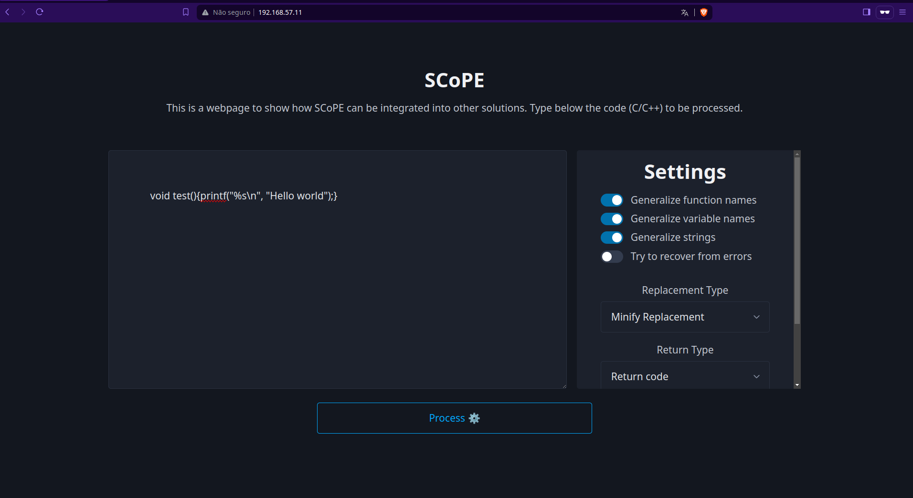
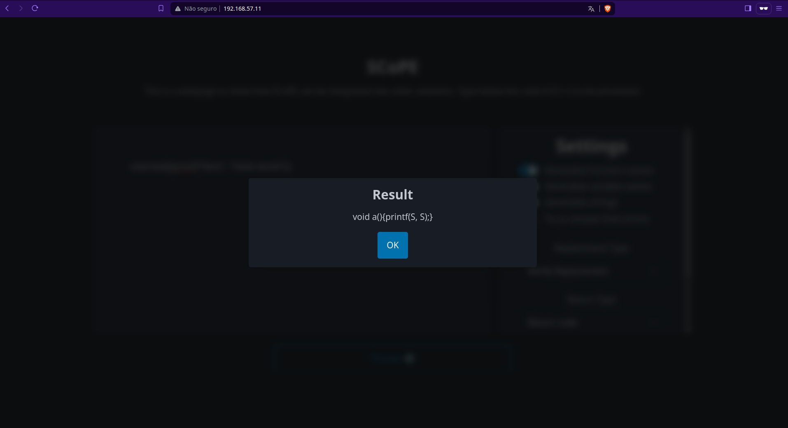

<h1 style="text-align: center;">
SCoPE<br>

</h1>  

This is the project repository for the paper: SCoPE: Evaluating LLMs for Software Vulnerability Detection  
The dataset used in this work is available in the [dataset](dataset/) folder.
## SCoPE  
**S**ource **Co**de **P**rocessing **E**ngine (SCoPE) is a framework which processes C/C++ functions. 
This tool implements some processing techniques that can be applied to the code:

* Generalization of function names  
    Ex: ```int funcaoTeste(){} ``` will be converted to ``` int a(){} ```. This helps to reduce the number of different tokens. **Note**:The function name "main" is not generalized on purpose.
* Generalization of variable names   
    Ex: ```int variavel_teste = 0; ``` will be converted to ``` int a = 0 ```. This helps to reduce the number of different tokens.
* String generalization 
    Ex: ```char query[] = "SELECT * FROM TABLE;"``` will be converted to ```char VAR0[] = S```. 
* Code formatting normalization
* Comments removal  
* Tokenization  

## How it works

The central approach consists of initially converting the code into an Abstract Syntactic Tree (AST) and then traversing this AST. When we come across a specific node in the tree that interests us, such as a variable declaration node, we trigger a class that contains the code responsible for processing that specific part of the tree. This process repeats itself util all nodes are visited.

## Dealing with macros

The used grammar cannot process code with macros. To mitigate this issue, SCoPE will use the antlr4 ability to recover from errors to try to process the code.   
**NOTE: THIS WILL LEAD TO INCOMPLETE CODE (if the token representation was selected) OR CODE THAT'S NOT COMPLETELY PROCESSED (if the code representation was selected, it may not detect the declaration of names in all parts of the code ).**

To use the recovery strategy, a flag must be passed to the function responsible for applying the processing techniques.
```python
def process( self,source, try_recover_from_errors = False):
```

When active, the code will try to recover from errors, crashing only in the case of syntax errors. For more information see the [class that manages the errors found](src/errors/ParserErrorHandler.py) and the [antlr website that describes the types of errors that can be found/managed](https://www.antlr.org/api/Java/org/antlr/v4/runtime/ANTLRErrorListener.html).  

## Important classes

The code developed can easily be used in a *jupyter notebook*, in a processing script or in an API. For example, the [ProcessCodeController](src/controllers/ProcessCodeController.py) class is called whenever we want to process code, but all it does is call the code below, which instantiates an object of type [TokenProcessor](src/service/TokenProcessorService.py) and then calls the *process* function of that object. That's all you need to use the code.
```python
store = TokenStore()
generalizer = GeneralizeService(replacementStrategy,generalize_functions, generalize_variables, generalize_strings)
t = TokenProcessorService(store, generalizer)
out = t.process(requestJson['code'], try_recover_from_errors=tryRecoverFromErrors)
```
Other important classes are the classes that run through the AST nodes. This part is relevant if you want to add new features.
These classes are in the [handlers](src/handlers/) directory, and all of them follow this idea: the [CustomVisitor](src/CustomVisitor.py) class implements a simple in-depth visit to the AST. For all the nodes found during the visit, this class executes the *handlerSelector* function, which checks to see if there are any handlers of its own to process that part of the tree. If there are, it executes the class responsible for processing that part of the tree, otherwise, it continues processing the tree until it reaches the terminal nodes, which coincide with the tokens in the code and are stored in a store to be retrieved and returned to the user (if this option is enabled).

## Integration with other solutions


This repository has two examples of how SCoPE can be used in other solutions. The examples are:
* Code processing REST API.
* Script for concurrent dataset processing.

### API example

The API was developed using *fastapi*, so it is necessary to install this library (it is already in the file [requirements.txt](src/requirements.txt)). To run the API, just execute the command in the [backend/src](src) directory:
``` bash
python -m uvicorn main:app --host 0.0.0.0 --port 8080
```

The API is simple, and only accepts a POST to */process* with the following mandatory parameters (JSON):
* **code**: STRING - C/C++ code to process  
**generalizeFunctionNames**: Bool - do we want the API to generalize function names?  
**generalizeVariableNames**: Bool - do we want the API to generalize variable names?  
**generalizeStrings**: Bool - do we want the API to generalize strings?  
**replacementStrategy**: int - Type of replacement: **Simple** (0), where we replace with VAR0, VAR1, FUNC0, FUNC1.... or **Minify**(1), where we replace with a, b, c, d, ... with the shortest possible name.  
**tryRecoverFromErrors**: Bool - do we want the API to try to recover from errors?  
**replacementStrategy**: int - return type: **Tokens** (0) or **Code** (1)  

Example of a JSON payload:
```json
{
    "code":"int main(){ int test = 0;}",
    "generalizeFunctionNames":true,
    "generalizeVariableNames":true,
    "generalizeStrings":true,
    "replacementStrategy":1,
    "tryRecoverFromErrors":false,
    "replacementStrategy":1
}
```
An example is located [here](examples/integration/). The docker file to build the API backend is located [in the root directory](Dockerfile), since Docker doesn't support copying files from parent directories.  

### Concurrent processing script

It's also simple to use the code directly: just copy the [src](src/) folder somewhere and use the code from the [TokenProcessor](src/service/TokenProcessorService.py) class as shown below:
```python
replacementStrategy = MinifyReplacement()
store = TokenStore()
generalizer = GeneralizeService(replacementStrategy,generalize_functions, generalize_variables, generalize_strings)
t = TokenProcessorService(store, generalizer)
out = t.process(CODE_HERE, try_recover_from_errors=tryRecoverFromErrors)
```  
An example script is located [here](examples/script_dataset_processing/main.py).  


## Testing SCoPE

It is also possible to test the API via a very simple frontend developed in HTML/JS. Although it's possible to run everything manually (frontend on an HTTP server + backend somewhere), it's simpler to use containers. So, two docker images were created, one for the backend and one for the frontend, used by *docker-compose* to make it easy to test the API.
These two containers are connected by a virtual network, with the following IP addresses:  

* Network: 192.168.57.0/16
* HTTP server (frontend)  
    * IP: 192.168.57.11
    * Port mapping: 80 from container -> 8888 from host
* API
    * IP: 192.168.57.11
    * Port mapping: 8080 from container -> 8080 from host

**Note:** On Linux it is possible to access the containers by their virtual IP address. On Windows, this is not possible.

To create the two containers and configure everything, just run the following command in [this directory](examples/integration) (where the docker-compose.yml file is):

```bash
docker-compose up
```

Then just go to the browser, with the address http://192.168.57.11/ to interact with the frontend of the API.
The API is available at http://192.168.57.10:8080/process

To stop, just press CTRL+C or use the command:  


```bash
docker-compose stop
```

## Gallery

  

